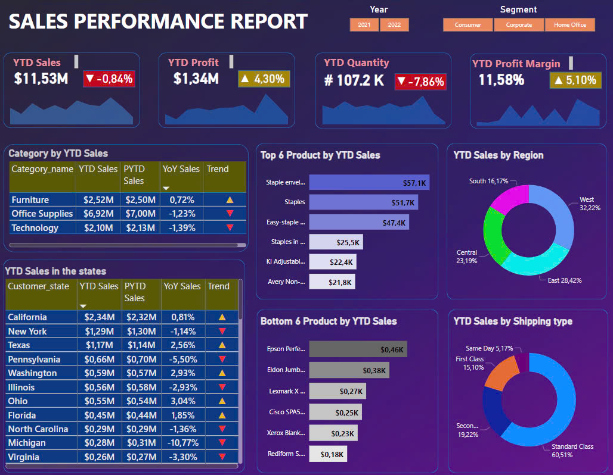
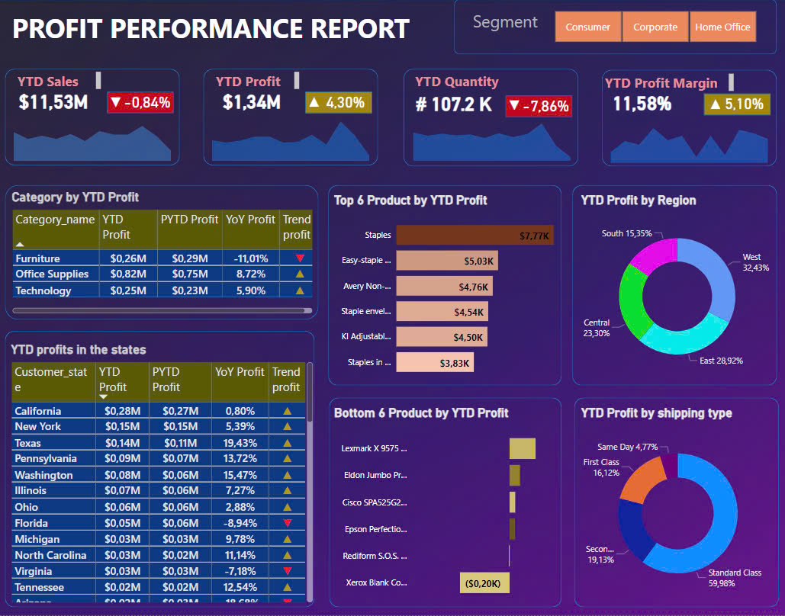
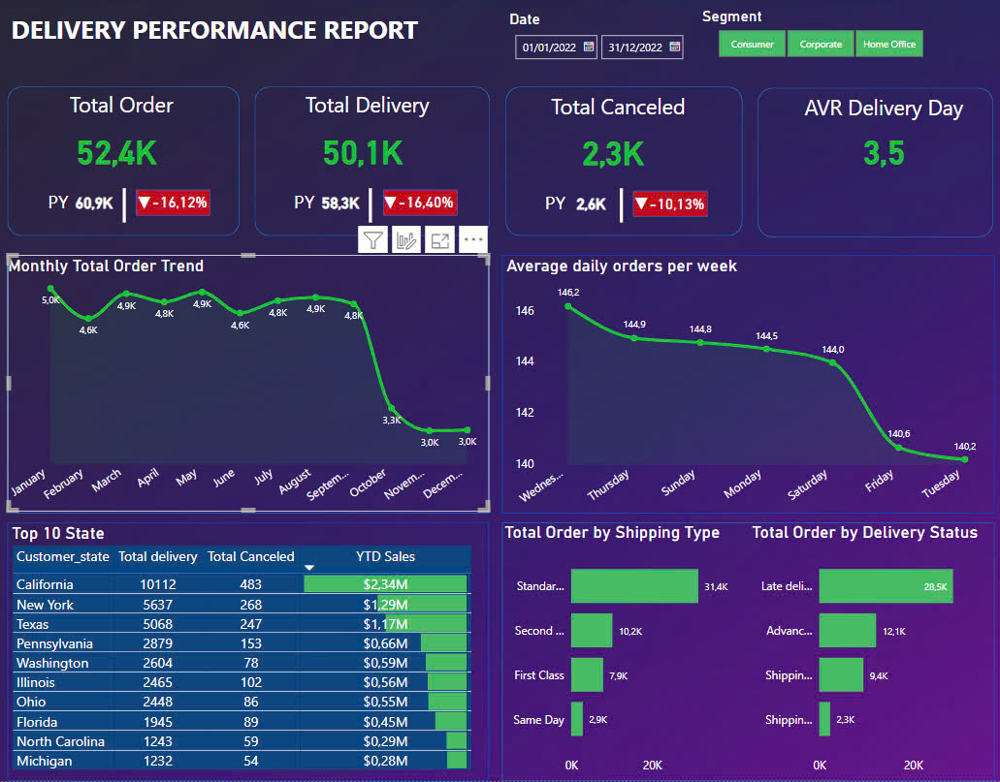

<h2> PERSONAL PROJECT: E-COMMERCE ANALYTICS </h2>

<h2>1. Objective</h2>

   The liquor retail project is a data analysis initiative focused on examining a company's revenue and profits over time. By analyzing reports, we can better understand the business performance and develop more effective business strategies for the future.

<h2>2. Approach</h2>
<ul>
   <li><strong>Data Processing:</strong> Clean data with Power Query in Power BI</li>
   <li><strong>Data Visualization:</strong>Create visual reports using Power BI.</li>
   <li><strong>Decision-Making:</strong>Analyze reports to assess the business situation over time, enabling informed decisions about future business strategies.</li>
</ul>

<h2>3. Result</h2>

  Revenue and profits have both grown significantly, approximately 30% compared to the previous year. The business performance in the second half of the year was better than in the first half, with the highest revenue recorded in October. The top three best-selling products are Canadian Whiskies, Vodka 80 proof, and Spiced Rum. The city with the best business performance is Des Moines.

  

  

  

  

  

