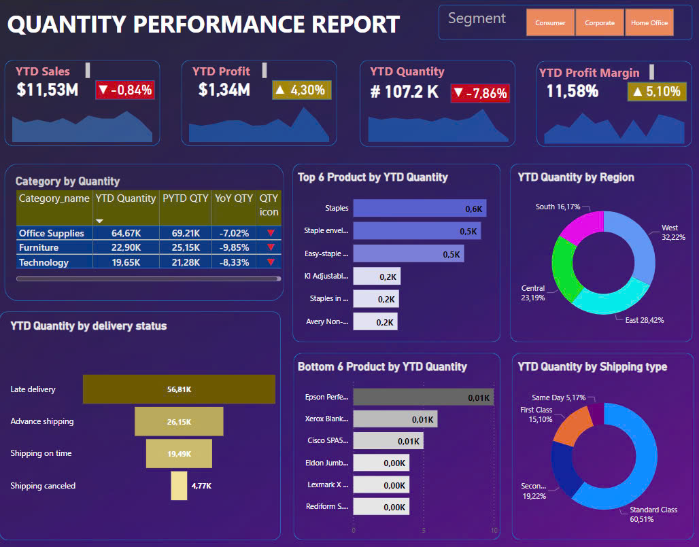

<h2> PERSONAL PROJECT: E-COMMERCE ANALYTICS </h2>

<h2>1. Objective</h2>

  

<h2>2. Approach</h2>
<ul>
   <li><strong>Data Processing:</strong> Clean data with Power Query in Power BI</li>
   <li><strong>Data Visualization:</strong>Create visual reports using Power BI.</li>
   <li><strong>Decision-Making:</strong>Analyze reports to assess the business situation over time, enabling informed decisions about future business strategies.</li>
</ul>

<h2>3. Result</h2>

  

  

  

  

  

  

